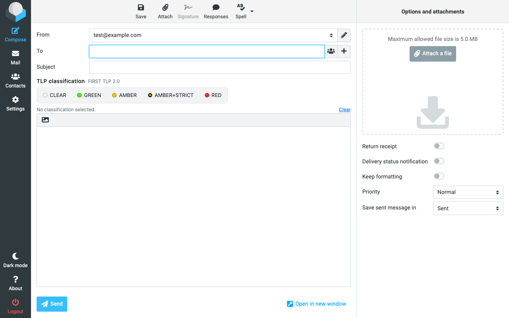
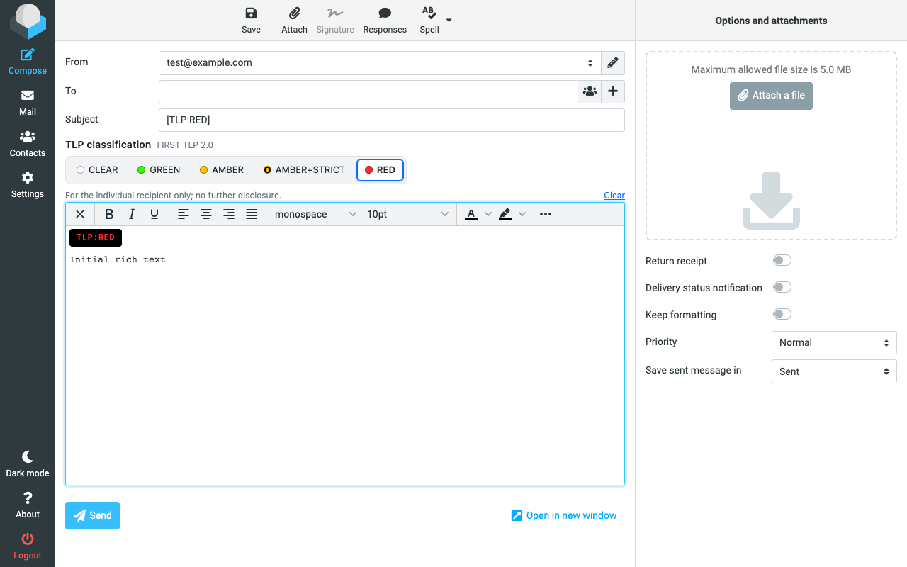
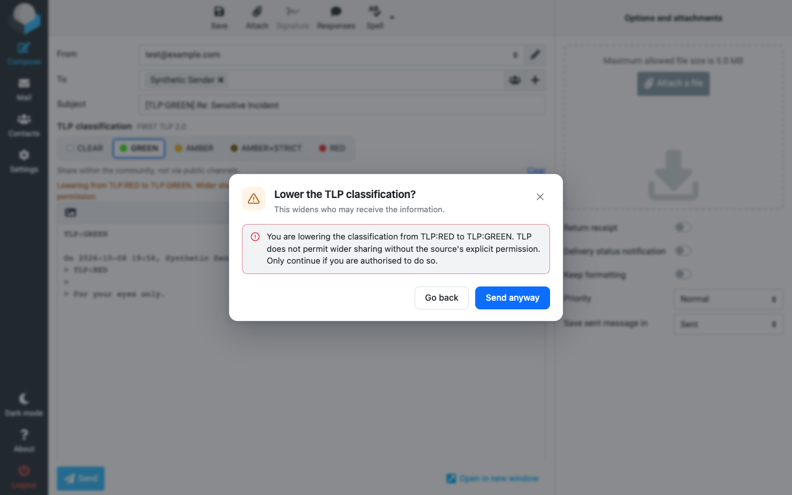
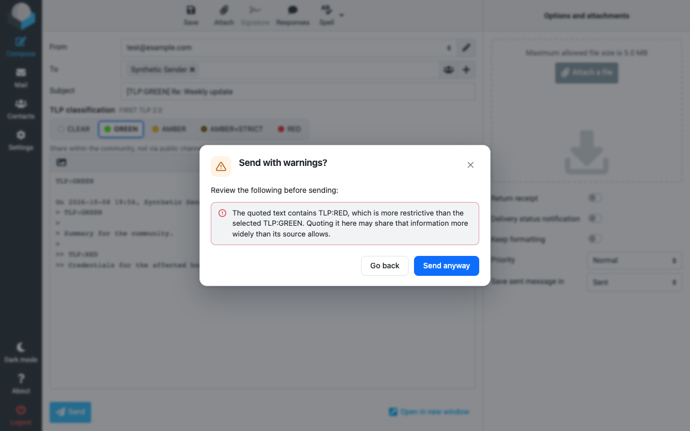

# TLP Mail Marker

A browser extension and a Thunderbird add-on that help you apply the **FIRST
Traffic Light Protocol (TLP) 2.0** to outgoing email in **Roundcube Webmail** and
**Thunderbird**. Both builds share the same classification engine.

Roundcube builds support **Chromium** and **Firefox desktop 140+**. Firefox
private testing uses a separate Mozilla-signed XPI; local builds produce an
unsigned ZIP. See the
[Firefox installation guide](docs/FIREFOX.md).

In Roundcube, TLP Mail Marker injects a small, accessible classification selector
into the message composer and applies the correct marking to the subject line and the
message body. It is designed for CSIRTs, CERTs, PSIRTs, government teams and
other organisations that exchange potentially sensitive information.

> **TLP is an information-sharing protocol, not encryption and not access
> control.** TLP Mail Marker is a composition aid. It is **not** a data-loss
> prevention (DLP) system and cannot guarantee that a message is handled
> correctly downstream. Browser-side checks can be bypassed.

## Features

- **All five TLP 2.0 levels:** `TLP:CLEAR`, `TLP:GREEN`, `TLP:AMBER`,
  `TLP:AMBER+STRICT`, `TLP:RED` — exact official syntax, and never the obsolete
  `TLP:WHITE`.
- Applies a canonical subject prefix (`[TLP:AMBER] …`) and a body marking,
  following the FIRST guidance that the label precedes the information and
  appears in the subject.
- Works with **plain-text and HTML (TinyMCE) composers**, new messages,
  replies, reply-all, forwards, pop-ups and drafts.
- **Detects an existing classification** in a message being replied to or
  forwarded and preselects it; lowering it triggers a warning, never a silent
  downgrade.
- **Send-time validation:** warns or blocks (configurable) when a message is
  unclassified, when the subject and body disagree, or when the marking is
  malformed. Browser checks run synchronously; Thunderbird waits for the native
  send review before delivering the message.
- **Idempotent marking:** repeated edits, automatic draft saves and HTML↔plain
  switches never duplicate markings and never alter signatures, quotes, links
  or attachments.
- **Privacy-first:** no telemetry, analytics, tracking, external APIs or remote
  code. Email content is never stored. Settings stay local; Thunderbird retains only
  TLP levels and tab IDs for open composers in session storage.
- **Least privilege:** no broad host permissions at install. You authorise each
  webmail host explicitly.
- **Browser enterprise policy:** administrators can preconfigure and lock the extension
  and grant host access through managed policy
  ([`docs/ENTERPRISE.md`](docs/ENTERPRISE.md)).
- **Localised browser UI** (English, French, German) while keeping the canonical TLP
  labels untranslated.

## Screenshots

| | |
| --- | --- |
|  |  |
|  |  |

## Supported clients

The first release targets **Roundcube Webmail** (tested on the 1.6.x line with
the Elastic skin). The TLP engine is provider-agnostic and providers are
plugged in behind an adapter interface; Gmail, Outlook Web and Zimbra are on
the roadmap. See [`docs/COMPATIBILITY.md`](docs/COMPATIBILITY.md) for the exact
validated versions. The native **Thunderbird 140+** add-on uses a compose-toolbar
selector and Thunderbird's send event. Install its separate XPI using
[`docs/THUNDERBIRD.md`](docs/THUNDERBIRD.md).

## Install (development / unpacked)

1. Build the extension:

   ```sh
   npm install
   npm run build        # outputs dist/
   ```

2. Open `chrome://extensions`, enable **Developer mode**.
3. Choose **Load unpacked** and select the `dist/` directory.
4. Open the extension's **Settings** and add your Roundcube host (for example
   `mail.example.gov`). Approve the browser permission prompt for that host.
5. Open the Roundcube composer — the TLP selector appears beneath the subject.

See [`docs/INSTALL.md`](docs/INSTALL.md) for more detail, including packaging.

For Firefox, run `npm run build:firefox`, open
`about:debugging#/runtime/this-firefox`, choose **Load Temporary Add-on**, and
select `dist-firefox/manifest.json`. Add your Roundcube host in Settings.
Temporary installation lasts until Firefox closes; permanent installation in
standard Firefox requires Mozilla signing.

## How it works

- The content script runs only on hosts you authorise. It detects the Roundcube
  composer from the stable composer DOM contract and does not depend on
  Roundcube's private JavaScript APIs.
- A tiny MAIN-world probe reads the public `rcmail.env.compose_mode` value
  (reply / forward / new / draft) and publishes it as a DOM attribute, because
  Roundcube rewrites the compose URL. It reads no message content.
- All TLP logic lives in a pure, unit-tested core (`src/core`). All webmail DOM
  work lives behind a provider adapter (`src/adapters`).

Architecture and design decisions: [`docs/ARCHITECTURE.md`](docs/ARCHITECTURE.md)
and [`docs/RESEARCH.md`](docs/RESEARCH.md).

## Development

```sh
npm run typecheck      # TypeScript strict check
npm test               # unit + integration tests (vitest)
npm run build          # production bundle
npm run build:dev      # readable bundle with sourcemaps
npm run e2e            # real-browser E2E against local Roundcube (Docker)
npm run package        # Chrome Web Store zip in release/
npm run build:thunderbird   # native Thunderbird add-on in dist-thunderbird/
npm run package:thunderbird # installable XPI in release/
npm run e2e:thunderbird     # native tests; set THUNDERBIRD_BINARY
```

The E2E suite starts a real Roundcube (Docker, SQLite) with a synthetic
GreenMail IMAP/SMTP server and drives Chromium with the extension loaded. No
production accounts or real messages are ever used. See
[`docs/TESTING.md`](docs/TESTING.md).

## Documentation

- [Installation](docs/INSTALL.md) · [User guide](docs/USER_GUIDE.md)
- [Thunderbird installation and usage](docs/THUNDERBIRD.md)
- [Private beta installation and tester checklist](docs/BETA-TESTING.md)
- [Shared organisation profiles](docs/ORGANISATION-PROFILES.md)
- [Architecture](docs/ARCHITECTURE.md) · [Research notes](docs/RESEARCH.md)
- [Compatibility & test matrix](docs/COMPATIBILITY.md) · [Testing](docs/TESTING.md)
- [Enterprise deployment](docs/ENTERPRISE.md)
- [Automated dependency updates](docs/DEPENDENCY_UPDATES.md)
- [Security review](docs/SECURITY_REVIEW.md) · [Chrome Web Store materials](docs/CHROME_WEB_STORE.md)

## Security and privacy

- No telemetry, no analytics, no external servers, no remote code.
- Settings stay in local profile storage; nothing is synced. The Thunderbird
  add-on also retains selected/original TLP levels for open composers in session
  storage. It never persists message content.
- See [`PRIVACY.md`](PRIVACY.md) for the privacy policy and
  [`SECURITY.md`](SECURITY.md) for the disclosure policy.
- A security review and its remediations are documented in
  [`docs/SECURITY_REVIEW.md`](docs/SECURITY_REVIEW.md).

## Known limitations

- Browser-side validation is **bypassable** and not equivalent to server-side
  policy.
- The browser build supports Roundcube; the separate native build supports
  Thunderbird. Other webmail providers fall back to a no-op.
- Automatic draft saving cannot be intercepted from the isolated world; it
  relies on idempotent marking rather than on hooking the save.
- TLP label detection in free text is heuristic: conflicting or legacy labels
  are reported rather than auto-resolved.
- Colour is an enhancement only; the text label is always present, and the
  extension never signals a classification by colour alone.

## Roadmap

- Additional providers (Gmail, Outlook Web, Zimbra).
- Optional end-of-text markers for long messages.
- Additional localisation.
- Enhanced report/export of classification metadata (never message content).

## Contributing

Contributions are welcome. Please read [`CONTRIBUTING.md`](CONTRIBUTING.md).

Maintainer: [**mustafa-kamoona**](https://github.com/mustafa-kamoona).

## License

[MIT](LICENSE). TLP Mail Marker is not affiliated with or endorsed by FIRST.
The TLP standard is published by FIRST at <https://www.first.org/tlp/>.
